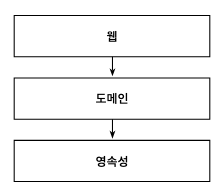
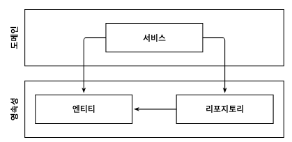
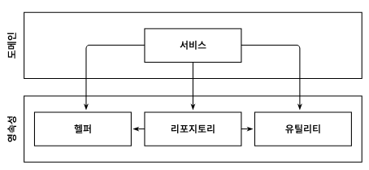

  

상위 수준 관점에서 일반적인 3계층 아키텍처를 표현한 그림니다.
맨 위의 웹 계층에서는 요청을 받아 도메인 혹은 비즈니스 계층에 있는 서비스로 요청을 보낸다.
서비스에서는 필요한 비즈니스 로직을 수행하고, 도메인 엔티티의 현재 상태를 조회하거나 변경하기 위해 영속성 계층의 컴포넌트를 호출한다.

잘 만들어진 계층형 아키텍처는 선택의 폭을 넓히고, 변화하는 요구사항과 외부 요인에 빠르게 적응할 수 있게 해준다.

그렇다면 계층형 아키텍처의 문제점은 무엇일까?

### 계층형 아키텍처는 데이터베이스 주도 설계를 유도한다.

정의에 따르면 전통적인 계층형 아키텍처의 토대는 데이터베이스이다.
웹 계층은 도메인 계층에 의존하고, 도메인 계정은 영속성 계층에 의존하기 때문에 자연스레 데이터베이스에 의존하기 된다.
즉, 모든 것이 영속성 계층을 토대로 만들어진다.

우리는 보통 비즈니스를 관장하는 규칙이나 정책을 반영한 모델을 만들어서 사용자가 이러한 규칙과 정책을 더욱 편리하게 활용할 수 있게 한다.
이때 우리는 상태가 아니라 행동을 중심으로 모델링한다. 그렇다면 우리는 왜 '도메인 로직'이 아닌 '데이터베이스'를 토대로 아키텍처를 만드는걸까?

데이터베이스 중심적인 아키텍처가 만들어지는 가장 큰 원인은 ORM 프레임워크를 사용하기 때문이다.

  

ORM에 의해 관리되는 엔티티들은 일반적으로 영속성 계층에 둔다. 계층은 아래 방향으로만 접근 가능하기 때문에 도메인 계층에서는 이러한 엔티티에 접근할 수 있다.
이렇게 되면 영속성 계층과 도메인 계층 사이에 강한 결합이 생긴다.

### 지름길을 택하기 쉬워진다.

전통적인 계층형 아키텍처에서 전체적으로 적용되는 유일한 규칙은, 특정한 계층에서는 같은 계정에 있는 컴포넌트나 아래에 있는 계층에만 접근 가능하다는 것이다.

만약 상위 계층에 위치한 컴포넌트에 접근해야 한다면 간단하게 컴포넌트를 계층 아래로 내려버리면 된다. 그러면 접근 가능하게 되고, 깔끔하게 문제가 해결된다.
딱 한번 이렇게 하는 것은 괜찮을 수 있다. 하지만 처음이 힘들지 그 다음부터는 죄책감이 훨씬 덜하다.

  

영속성 계층은 수년에 걸친 개발과 유지보수로 결국 위와같이 될 확률이 높다.
적어도 추가적인 아키텍처 규칙을 강제하지 않는 한 계층은 최선의 선택은 아니다.

### 테스트하기 어려워진다

엔티티의 필드를 단 하나만 조작하면 되는 경우에 웹 계층에서 바로 영속성 계층에 접근하면 도메인 계층을 건드릴 필요가 없지 않을까?
처음 몇 번은 괜찮게 느껴지지만 이런 일이 자주 일어난다면 두가지 문제점이 생긴다.

1. 단 하나의 필드를 조작하는 것에 불과하더라도 도메인 로직을 웹 계층에서 구현하게 된다.
2. 웹 계층 테스트에서 도메인 계층뿐만 아니라 영속성 계층도 모킹해야 된다.

### 유스케이스를 숨긴다

기능을 추가하거나 변경할 적절한 위치를 찾는 일이 빈번하기 때문에 아키텍처는 코드를 빠르게 탐색하는 데 도움이 돼야 한다.
유스케이스가 '간단'해서 도메인 계층을 생략한다면 웹 계층에 존재할 수도 있고, 도메인 계층과 영속성 계층 모두에 접근할 수 있도록
컴포넌트를 아래로 내렸다면 영속성 계층에 존재할 수도 있다. 이럴 경우 새로운 기능을 추가할 적당한 위치를 찾는 일은 이미 어려워진 상태다.

