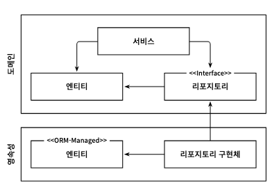
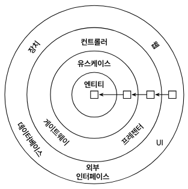

### 단일 책임 원칙

- 컴포넌트를 변경하는 이유는 오직 하나뿐이어야 한다.

만약 컴포넌트를 변경할 이유가 한 가지라면 우리가 어떤 다른 이유로 소프트웨어를 변경하더라도 이 컴포넌트에 대해서는 전혀 신경 쓸 필요가 없다.
소프트웨어가 변경되더라도 여전히 우리가 기대한 대로 동작할 것이기 때문이다.

안타깝게도 변경할 이유라는 것은 컴포넌트 간의 의존성을 통해 너무도 쉽게 전파된다.

### 의존성 역전 원칙

단일책임 원칙을 고수준에서 적용할 때 상위 계층들이 하위 계층들에 비해 변경할 이유가 더 많다는 것을 알 수 있다.
그러므로 영속성 계층에 대한 도메인 계층의 의존성 때문에 영속성 계층을 변경할 때마다 잠재적으로 도메인 계층도 변경해야 한다.

- 코드상의 어떤 의존성이든 그 방향을 바꿀 수(역전시킬 수) 있다.

도메인 계층에 영속성 계층의 엔티티와 리포지토리와 상호작용하는 서비스가 하나 있다.
엔티티는 도메인 객체를 표현하고 도메인 코드는 이 엔티티들의 상태를 변경하는 일을 중심으로 하기 때문에
먼저 엔티티를 도메인 계층으로 올린다.

그러나 이제는 영속성 계층의 리포지토리가 도메인 계층에 있는 엔티티에 의존하기 때문에 두 계층 사이에 순환 의존성이 생긴다.
이 부분이 바로 DIP를 적용하는 부분이다. 도메인 계층에 리포지토리에 대한 인터페이스를 만들고, 실제 리포지토리는 영속성 계층에서 구현하게 하는 것이다.

  

### 클린 아키텍처

도메인 코드가 바깥으로 향하는 어떤 의존성도 없어야 함을 의미한다. 대신 의존성 역전 원칙의 도움으로 모든 의존성이 도메인 코드를 향하고 있다.

  

이 아키텍처에서 계층들은 동심원으로 둘러싸여 있다. 가장 주요한 규칙은 의존성 규칙으로, 계층 간의 모든 의존성이 안쪽으로 향해야 한다는 것이다.

