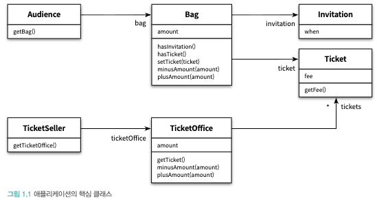
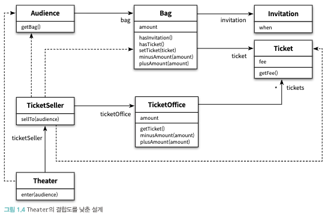

## 이론과 실무 어디에 초점을 맞춰야할까 ?

훌륭한 소프트웨어를 만들기 위해서는 이론을 먼저 배우기보다, 코드를 통해 실무를 경험하고 그 뒤에 이론으로 정리하는 접근이 가장 효과적이다.

이론은 규모가 커질수록 소프트웨어 설계를 설명하는 데 도움이 되지만, 이론만으로 실무의 복잡성과 현실을 대체할 수는 없다.
가장 효과적인 학습과 이해 방법은 추상적인 개념 설명이 아니라 실제 코드와 프로그램을 통해 경험하는 것이다.

> 예제 코드는 포스팅을 통해 다루지 않을 예정입니다. 책을 참고해주세요.

## 01. 티켓 판매 애플리케이션 구현하기

### 작은 이벤트 기획

- 추첨을 통해 선정된 관람객에게 공연을 무료로 관람할 수 있는 초대장을 발송하는 것
- 이벤트에 당첨된 관람객과 그렇지 않은 관람객은 다른 방식으로 입장을 시켜야 한다.
    - 이벤트에 당첨된 관람객은 초대장을 티켓으로 교환 후 입장
    - 이벤트에 당첨되지 않은 관람객은 티켓을 구매해야만 입장

### 진행 방향

1. 소극장은 먼저 관람객의 가방 안에 초대장이 들어 있는지 확인한다.
2. 만약 초대장이 들어 있다면 이벤트에 당첨된 관람객이므로 판매원에게서 받은 티켓을 관람객의 가방 안에 넣어준다.
3. 가방 안에 초대장이 없다면 티켓을 판매해야 한다.
4. 이 경우 소극장은 관람객의 가방에서 티켓 금액만큼을 차감한 후 매표소에 금액을 증가시킨다.
5. 마지막으로 소극장은 관람객의 가방 안에 티켓을 넣어줌으로써 관람객의 입장 절차를 끝낸다.

## 02. 무엇이 문제인가

### 소프트웨어 모듈의 세 가지 기능 (로버트 마틴)

* 실행 중에 제대로 동작하는 것
* 변경을 위해 존재하는 것
* 코드를 읽는 사람과 의사소통하는 것

### 예상을 빗나가는 코드

- 관람객과 판매원이 소극장 통제를 받는 수동적인 존재라는 점
    - 코드를 읽는 사람과 제대로 의사소통 불가
    - 여러 가지 세부적인 내용들을 한꺼번에 기억해야 함

### 변경에 취약한 코드

위 문제보다 더 큰 문제는 변경에 취약하다는 것이다.

- 관람객이 현금과 초대장을 보관하기 위해 항상 가방을 들고 다닌다고 가정
- 판매원이 매표소에서만 티켓을 판매한다고 가정

#### 의존성

의존성은 `변경`에 대한 영향을 암시한다. 의존성이라는 말 속에는 어떤 객체가 변경될 때 그 객체에게 의존하는 다른 객체도 함께 변경될 수 있다는 사실이 내포돼 있다.

하지만 의존성을 완전히 없애는 것은 정답이 아니다.
애플리케이션의 기능을 수행하는 데 필요한 `최소한의 의존성`만 유지하고 불필요한 의존성을 제거하는 것

> 객체 사이의 의존성이 과한 경우를 가르켜 `결합도가 높다`고 말한다.
> 반대로 객체들이 합리적인 수준으로 의존할 경우에는 `결합도가 낮다`고 말한다.

### 03. 설계 개선하기

관람객과 판매원을 `자율적인 존재`로 만들자

#### 자율성을 높이자

- 캡슐화를 통해 객체 내부로의 접근을 제한하면 객체와 객체 사이의 결합도를 낮출 수 있다.
- 객체를 인터페이스와 구현으로 나누고 인터페이스만을 공개하는 것은 객체 사이의 결합도를 낮추는 것이 기본적인 설계 원칙이다.

#### 무엇이 개선됐는가

- 코드를 읽는 사람과의 의사소통이라는 관점에서 개선
- 변경 용의성 측면에서도 확실히 개선

#### 어떻게 한 것인가

- 자신의 문제를 스스로 해결하도록 코드 변경

#### 캡슐화와 응집도

- 핵심은 객체 내부의 상태를 캡슐화하고 객체 간에 오직 메시지를 통해서만 상호작용하도록 만드는 것
- 객체의 응집도를 높이기 위해서는 객체 스스로 자신의 데이터를 책임져야한다.

> 밀접하게 연관된 작업만을 수행하고 연관성 없는 작업은 다른 객체에게 위임하는 객체를 가르켜 응집도가 높다고 말한다.

#### 절차지향과 객체지향

- 절차적 프로그래밍
    - 프로세스와 데이터를 `별도의 모듈`에 위치시키는 방식
    - 절차적 프로그래밍은 프로세스가 필요한 모든 데이터에 의존해야 한다는 근본적인 문제점 떄문에 변경에 취약하다.
- 객체지향 프로그래밍
    - 데이터와 프로세스가 `동일한 모듈 내부`에 위치하도록 프로그래밍하는 방식

#### 책임의 이동

두 방식 사이에 근본적인 차이를 만드는 것은 `책임의 이동`이다. 여기서 `책임`을 기능을 가리키는 객체지향 세계의 용어로 생각해도 무방하다.

- 절차적 프로그래밍
    - 책임이 한 곳에 집중되어있는 것
- 객체지향 프로그래밍
    - 각 객체는 `자신을 스스로 책임`지는 것

> **추가 유념할 점**
> - `능동적이고 자율적인 존재`로 소프트웨어 객체를 설계하는 원칙을 가르켜 의인화라고 부른다.
> - 결과적으로 불필요한 세부사항을 객체 내부로 `캡슐화`하는 것은 객체의 `자율성`을 높이고 응집도 높은 객체들의 공동체로 창조된다.
> - 어떤 기능을 설계하는 방법은 한 가지 이상일 수 있고, 동일한 기능을 한 가지 이상의 방법으로 설계할 수 있기 때문에 결국 설계는 트레이드오프의 산물이다.
