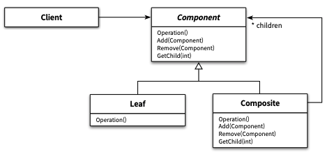

소프트웨어 설계에서 반복적으로 발생하는 문제에 대해 반복적으로 적용할 수 있는 해결 방법을
**디자인 패턴** 이라고 부른다.
디자인 패턴은 다양한 변경을 다루기 위해 반복적으로 **재사용** 할 수 있는 설계의 묶음이다.

프레임워크는 설계와 코드를 함꼐 재사용하기 위한 것이다. 애플리케이션의 아키텍처를 구현 코드의 형태로 제공한다.
프레임워크는 각 애플리케이션 요구에 따라 적절하게 커스터마이징할 수 있는 확장 포인트를 제공한다.

## 01. 디자인 패턴과 설계 재사용

### 소프트웨어 패턴

패턴이란 무엇인가 논의할 때면 반복적으로 언급되는 몇 가지 핵심적인 특징

- 패턴은 반복적으로 발생하는 문제와 해법의 쌍으로 정의된다.
- 패턴을 사용함으로써 이미 알려진 문제와 이에 대한 해법을 문서로 정리할 수 있으며, 이 지식을 다른 사람과 의사소통할 수 있다.
- 패턴은 추상적인 원칙과 실제 코드 작성 사이의 간극을 메워주며 실질적인 코드 작성을 돕는다.
- 패턴의 요즘은 패턴이 실무에서 탄생했다는 점이다.

패턴은 홀로 존재하지 않는다. 특정 패턴 내에 포함된 컴포넌트와 컴포넌트 같의 관계는 더 작은 패턴에 의해 서술될 수 있으며,
패턴들을 포함하는 더 큰 패턴 내에 통합될 수 있다. 연관된 패턴들의 집합들이 모여 하나의 **패턴 언어**를 구성한다고 정의하고 있다.

### 패턴 분류

패턴의 범위나 적용 단계에 따라 아키텍처 **패턴, 분석 패턴, 디자인 패턴, 이디엄** 4가지로 분류하는 것이다.

디자인 패턴은 특정한 설계 문제를 해결하는 것을 목적으로 하며, 프로그래밍 언어나 프로그래밍 패러다임에 독립적이다.
디자인 패턴의 상위에는 소프트웨어의 전체적인 구조를 결정하기 위해 사용할 수 있는 **아키텍처 패턴**이 위치한다.

아키텍처 패턴은 미리 정의된 서브시스템들을 제공하고, 각 서브시스템들의 책임을 정의하며, 서브시스템들 사이의
관계를 조직화하는 규칙과 가이드라인을 포함한다.
디자인 패턴과 마찬가지로 프로그래밍 언어나 프로그래밍 패러다임에 독립적이다.

디자인 패턴의 하위에는 이디엄이 위치한다. 이디엄은 특정 프로그래밍 언어에만 국한된 하위 레벨 패턴으로,
주어진 언어의 기능을 사용해 컴포넌트 혹은 컴포넌트 간의 특정 픅면을 구현하는 방법을 서술한다.

분석 패턴은 도메인 내의 개념적인 문제를 해결하는 데 초점을 맞춘다. 분석패턴은 업무 모델링 시에 발견되는 공통적인
구조를 표현하는 개념들의 집합이다.

### 패턴과 책임-주도 설계

특정한 상황에 적용 가능한 패턴을 잘 알고 있따면 책임 주도 설계의 절차를 하나하나 따르지 않고도 시스템 안에 구현할
객체들의 역할과 책임, 협력 관계를 빠르고 손쉽게 구성할 수 있다.

패턴의 구성 요소는 클래스가 아니라 **역할**이다.
예를 들어, 클라이언트가 개별 객체와 복합 객체를 동일하게 취급할 수 있는 COMPOSITE 패턴을 살펴보자.
아래 이미지는 COMPOSITE 패턴의 일반적인 구조이다. 패턴의 구성 요소인 Component, Composite, Leaf는
클래스가 아니라 협력에 참여하는 객체들의 역할이다.
Component는 역할이기 때문에 Component가 제공하는 오퍼레이션을 구현하는 어떤 객체라도 Component의 역할을 수행할 수 있다.

  

### 캡슐화와 디자인 패턴

알고리즘을 캡슐화하기 위해 합성 관계가 아닌 상속 관계를 사용하는 것을 **TEMPLATE METHOD** 패턴이라고 한다.
TEMPLATE METHOD 패턴은 부모 클래스가 알고리즘의 기본 구조를 정의하고 구체적인 단계는 자식 클래스에서
정의하게 함으로써 변경을 캡슐화할 수 있는 디자인 패턴이다.
다만 합성보다는 결합도가 높은 **상속**을 사용했기 때문에 STRATEGY 패턴처럼
런타임에 객체의 알고리즘을 변경하는 것은 불가능하다.
하지만 알고리즘 교체와 같은 요구사항이 없다면 상대적으로 STRATEGY 패턴보다
복잡도를 낮출 수 있다는 면에서는 장점이라고 할 수 있다.

DECORATOR 패턴은 객체의 행동을 동적으로 추가할 수 있게 해주는 패턴으로서
기본적으로 객체의 행동을 결합하기 위해 객체 합성을 사용한다.

DECORATOR 패턴은 선택적인 행동의 개수와 순서에 대한 변경을 캡슐화할 수 있다.

### 패턴은 출발점이다

패턴을 가장 효과적으로 적용하는 방법은 패턴을 지향하거나 패턴을 목표로 리팩터링하는 것이라고 이야기한다.

패턴이 적용된 최종 결과를 이해하는 것보다는 패턴을 목료포 리팩터링하는 이유를 이해하는 것이 훨씬 가치 있으며,
훌륭한 소프트웨어 설계가 발전해 온 과정을 공부하는 것이 훌륭한 설계 자체를 공부하는 것보다 훨씬 중요하다고 이야기한다.

## 02. 프레임워크와 코드 재사용

