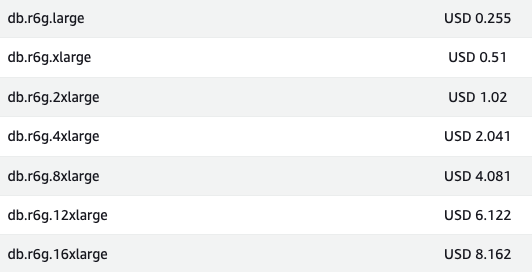

"트래픽이 늘면 scale-out이 답이다. scale-up은 비싸고 한계가 있다."
이 문장은 너무 자주 들어서 한 번도 의심해본 적이 없었습니다.
그런데 어느 날 AWS RDS 가격표를 직접 들여다보다가 멈칫했습니다.
**서버 사양을 두 배로 올리는 것과 서버를 한 대 더 추가하는 것의 비용이 거의 같았기 때문**입니다.

과연 scale-out이 항상 정답일지 **비용**적인 측면에서 확인해보고 싶어 정리해보려고 합니다.

## 🔎 따져보기

### "Scale-out이 더 싸다"는 정말일까?

'큰 서버 한 대를 사는 것보다 작은 서버 여러 대를 운영하는 게 더 저렴하다'는
근거는 보통 **고사양 서버는 가격이 비선형적으로 비싸진다**는 데서 옵니다.
쉽게 말해, 사양이 두 배가 되면 가격이 두 배가 아니라 세 배, 네 배로 뛴다는 이야기죠.

직접 AWS RDS의 r6g 시리즈(메모리 위주의 서버 종류 중 하나) 가격을 확인해보면 흥미롭습니다.
서울 리전, MySQL 기준 대략값이에요.

  

같은 시리즈 안에서는 **자원(CPU·메모리) 한 단위당 가격이 거의 일정**합니다.
즉, `large` 두 대를 운영하든, `xlarge` 한 대로 올리든 서버 요금 자체는 같습니다.
"scale-out이 압도적으로 싸다"는 말은 적어도 서버 요금만 보면 사실이 아니었던 거죠.

### 그럼 왜 사람들은 scale-out이 싸다고 할까?

물론 가격이 비선형적으로 뛰는 구간이 분명히 존재합니다.

- 같은 시리즈에서 **가장 큰 사양을 넘어서면**, 더 특수한 시리즈로 갈아타야 하는데, 거기서부터 가격이 확 뜁니다.
- 결국 "큰 서버는 비싸다"는 말은 **고사양**에서 성립합니다.

중간 구간에서는 두 방식의 서버 요금이 비슷하다는 점, 이게 첫 번째 발견이었습니다.

## 🛠️ "비용"이라는 단어가 숨기고 있는 것들

### 서버 요금 외에 따라붙는 비용들

가격표만 보면 비슷해 보이지만, 실제 청구서는 다르게 찍힙니다.

**Scale-out에 추가되는 비용**

- **저장 공간 복사 비용**: read replica는 원본과 같은 크기의 저장 공간을 따로 갖습니다.
  1TB짜리 DB라면 복제본을 한 대 추가하는 순간 1TB 저장 공간 요금이 그대로 더 붙어요.
- **네트워크 비용**: 데이터센터끼리 데이터를 주고받는 트래픽(예: 서울 리전 안의 서로 다른 건물 간 통신, cross-AZ)은 GB당 따로 과금됩니다.
  쓰기가 많은 서비스라면 무시할 수 없는 금액이 됩니다.
- **백업 비용**: 서버가 늘어날수록 백업 용량도 비례해서 늘어납니다.

**Scale-up에 추가되는 비용**

- **다운타임 비용**: 서버 사양을 바꾸려면 보통 재시작이 필요합니다.
  자동 전환 기능(Multi-AZ, 평소엔 보조 서버를 대기시켜 놓고 본 서버에 문제가 생기면 자동으로 넘기는 기능)을 써도 잠깐의 끊김은 생깁니다.
  이 끊김이 매출 손실로 이어진다면 그것도 비용이죠.
- **장기 할인 약정의 경직성**: 1년·3년 단위로 미리 결제해두는 할인(예약 인스턴스)을 사놓은 상태에서 사양을 더 키우면, 기존에 사둔 약정이 일부 낭비될 수 있습니다.

**눈에 안 보이는 운영 비용**

- Scale-out은 read/write splitting 로직, replication lag 모니터링, failover 시나리오 테스트 등 **개발·운영 공수**가 발생합니다.
- Scale-up은 단순합니다. 사양을 골라 누르고 적용하면 끝입니다.

엔지니어의 시간도 비용입니다. 그리고 종종 서버 비용보다 비쌉니다.

### 사실 둘은 같은 문제를 푸는 게 아니다

비교 자체가 성립하지 않는 경우도 많습니다.

- **Scale-up**은 쓰기와 읽기를 모두 포함한 전체 처리량을 늘립니다. 단일 장애점은 그대로입니다.
- **Scale-out (read replica)** 은 주로 읽기 부하를 분산합니다. 쓰기 처리량은 그대로이고, 대신 가용성이 올라갑니다.

읽기 요청이 90%, 쓰기 요청이 10%인 서비스에서 쓰기는 여유로운데 읽기 부하만 폭증한다면 복제본 추가가 자연스럽습니다.
반대로 읽기와 쓰기 비율이 5:5에 가까운데 쓰기 응답 속도가 문제라면, 읽기 복제본을 아무리 추가해도 해결되지 않습니다.
**"어느 게 더 싸냐"는 질문에는 항상 '어떤 종류의 트래픽이냐'라는 전제가 빠져 있습니다.**

### Scale-up의 진짜 한계

가장 본질적인 차이는 결국 **천장**입니다.
어떤 서버 시리즈든 살 수 있는 가장 큰 사양이 정해져 있습니다.
거기에 도달하면 그다음은 무조건 여러 대로 나누는 길밖에 없어요. 선택의 여지가 없습니다.

그래서 많은 팀이 "**언젠가 분산해야 한다면 일찍 시작하는 게 낫다**"는 논리로 scale-out을 택합니다.
이건 비용이라기보다 **미래에 닥칠 비용을 미리 분산해두는 보험** 관점에 가깝습니다.

## 💭 마치며

처음에는 단순한 가격 비교 글을 쓰려고 했습니다.
그런데 들여다볼수록 **비용이라는 단어가 가리고 있는 게 너무 많다**는 걸 알게 됐습니다.

인스턴스 요금, 스토리지, 네트워크, 다운타임, 엔지니어 시간, 미래의 천장까지 이걸 다 합쳐서 단일한 숫자로 비교하는 건 사실 불가능에 가깝습니다.

다만 한 가지는 분명해졌습니다.
"scale-out이 무조건 싸다" 혹은 "scale-up은 한계가 있으니 피해야 한다"는 말은 **반쪽짜리 진실**이라는 것.
중간 트래픽 구간에서는 scale-up이 가장 단순하고 충분히 합리적인 선택일 수 있습니다.
복잡도를 미리 끌어안는 비용이 인스턴스 가격 차이보다 클 수도 있으니까요.

다음번에 인프라 의사결정 회의에서 누군가 "scale-out이 더 쌉니다"라고 말한다면,
"어떤 비용 기준으로요?"라고 한 번 되물어볼 수 있게 된 것 같습니다.