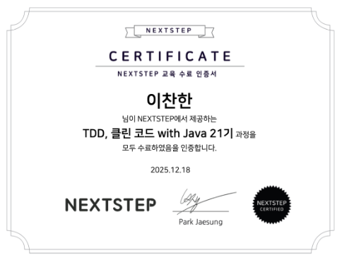

NextStep TDD, 클린 코드 with Java 21기 후기를 남겨보려고 합니다!

이 과정을 선택한 이유는 수료생들의 후기 덕분이었습니다. 교육을 통해 **코드 스타일이 많이 바뀌었다**는 내용이 많았고, 
20기까지 꾸준히 운영되어 온 만큼 수료생들의 평가가 하나같이 긍정적이었습니다.

하지만 짧은 교육 일정에 비해 강의 비용이 부담스러워 선뜻 신청하지 못하고 고민하던 중, 
같은 동아리 회원 중 해당 과정을 수료하신 분의 조언을 들을 수 있었고, 현재에 머물러 있지 않고 한 걸음 더 나아가고 싶어 교육 과정에 신청하게 되었습니다.

## 🏃‍♂️ 과정을 진행하며

과정은 총 4개의 미션으로 이루어져 있으며, 우아한테크코스에서 학습용으로 사용하는 코드를 베이스로 진행되었습니다. 
첫 번째와 두 번째 미션은 TDD와 OOP에 대해 익숙해지는 시간이었고, 세 번째 미션은 실무와 유사한 환경의 코드를 리팩터링하는 과정이었습니다. 마지막 네 번째 미션은 선택사항으로 진행되었습니다.

평소 업무를 진행하며 저를 객관적으로 평가하기 어렵다고 느꼈습니다. 이번 과정을 통해 객관적인 시선으로 저를 바라볼 수 있었고, 
아직 배울 것이 많은 주니어 개발자라는 것을 다시 한번 느끼게 되었습니다.

사내 리뷰 문화가 도입되어 있지 않은 저에게 멘토님의 리뷰 하나하나가 소중했습니다. 
21기는 포비님께서 직접 모든 수강생의 리뷰를 진행해 주셨고, 리뷰의 내용은 정답이 아닌 문제를 해결할 수 있는 방향성을 제시해 주셨습니다.

이 과정을 통해 문제가 발생했을 때 AI나 구글링이 아닌, 스스로 문제를 해결할 수 있는 사고력을 키울 수 있었습니다.

교육 과정이 긴 시간은 아니었지만, 단기간에 객체를 바라보는 관점과 코드를 작성하는 스타일이 많이 바뀌었습니다. 
교육을 통해 배운 기술이 익숙해지도록 현업에서 활용하며, 동료들에게 전파하고 싶습니다.

## 📊 미션별 PR 리뷰

### 자동차 경주 - 단위 테스트

[👉🏻 1단계 : 학습 테스트 실습](https://github.com/next-step/java-racingcar/pull/6161)

[👉🏻 2단계 : 문자열 덧셈 계산기](https://github.com/next-step/java-racingcar/pull/6171)

[👉🏻 3단계 : 자동차 경주](https://github.com/next-step/java-racingcar/pull/6188)

[👉🏻 4단계 : 자동차 경주(우승자)](https://github.com/next-step/java-racingcar/pull/6202)

[👉🏻 5단계 : 자동차 경주(추가 연습)](https://github.com/next-step/java-racingcar/pull/6222)

### 로또 - TDD

[👉🏻 1단계 : 문자열 계산기](https://github.com/next-step/java-lotto/pull/4195)

[👉🏻 2단계 : 로또(자동)](https://github.com/next-step/java-lotto/pull/4198)

[👉🏻 3단계 : 로또(2등)](https://github.com/next-step/java-lotto/pull/4202)

[👉🏻 4단계 : 로또(수동)](https://github.com/next-step/java-lotto/pull/4212)

### 수강신청 - 레거시 리팩터링

[👉🏻 1단계 : 레거시 코드 리팩터링](https://github.com/next-step/java-lms/pull/790)

[👉🏻 2단계 : 수강신청(도메인 모델)](https://github.com/next-step/java-lms/pull/793)

[👉🏻 3단계 : 수강신청(DB 적용)](https://github.com/next-step/java-lms/pull/798)

[👉🏻 4단계 : 수강신청(요구사항 변경)](https://github.com/next-step/java-lms/pull/808)

### 사다리타기 - FP, OOP(추가 미션)

[👉🏻 1단계 : 스트림, 람다, Optional](https://github.com/next-step/java-ladder/pull/2426)

[👉🏻 2단계 : 사다리(생성)](https://github.com/next-step/java-ladder/pull/2427)

[👉🏻 3단계 : 사다리(게임 실행)](https://github.com/next-step/java-ladder/pull/2432)

[👉🏻 4단계 : 사다리(리팩터링)](https://github.com/chanani)

## 💭 마치며

21기 수강생분들 모두 열심히 참여했고, 교육 내용뿐만 아니라 수강생분들에게서도 배울 점이 정말 많았습니다. 
이렇게 성장할 수 있는 시간은 주니어 개발자에게 꼭 필요하다고 생각하며, '동료에게 이 강의를 추천할 만해?'라고 묻는다면 망설임 없이 
**'뭐 해, 당장 신청해!!!'** 라고 답할 만한 교육입니다.

  

